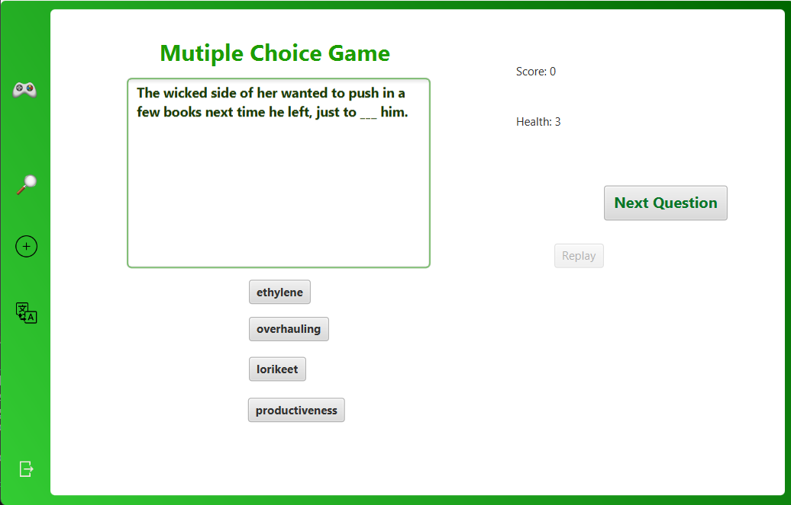

# btl_oop_k66k1
# Dictionary App

#### Table of contents
1. [Giới thiệu](#introduction)
2. [Tính năng nổi bật](#features)
3. [Cách sử dụng](#user-guide)
4. [Cài đặt](#installation)

# Giới thiệu 

* Ứng dụng từ điển giúp cho người dùng có thể tra cứu, học từ vựng tiếng Anh một cách nhanh và hiệu quả nhất.
* Ứng dụng được viết bằng ngôn ngữ Java và sử dụng thư viện JavaFX để hỗ trợ tạo giao diện đồ hoạ.
* Ứng dụng có tích các game thú vị để học từ vựng: Game trắc nghiệm, Game nối từ, Game đoán từ.
* Tác giả: Trần Quang Duy & Vũ Ngọc Duy from K66K1.

# Tính năng nổi bật 

* Tìm từ, mỗi khi gõ kí tự vào ô tìm kiếm, ứng dụng sẽ tự động đề xuất những từ bắt đầu bằng những kí tự đã nhập vào. Nếu từ nhập vào không có trong từ điển, ứng dụng sẽ đề xuất những từ gần giống với từ nhập vào đó.
* Với mỗi từ sẽ có phần giải nghĩa hiển thị ở bên phải của khu vực chứa danh sách các từ tìm kiếm.
* Ứng dụng cho phép người dùng chuyển đổi từ điển, có thể dịch đa ngôn ngữ (Tiếng Anh, Tiếng Việt, Tiếng Pháp, Tiếng Trung), kiểu mặc định là dịch sang ngôn ngữ Tiếng Anh.
* Ứng dụng có chức năng thêm, xoá hoặc sửa lại nghĩa của từ vựng. Những thay đổi này sẽ được cập nhật vào dữ liệu từ điển của ứng dụng. Không thêm được từ đã có sẵn trong từ điển mà chỉ có thể chỉnh sửa nghĩa của từ đó nếu muốn.
* Một tính năng nữa của ứng dụng đó là phát âm từ vựng. Ở mỗi phần giải nghĩa của từ tiếng Anh, có giọng đọc là Anh-Anh (kelvin).
* Người sử dụng có thể tra cứu từ vựng trực tiếp từ dữ liệu của ứng dụng hoặc có thể sử dụng Google API để dịch từ hoặc câu như ứng dụng Google Translate.
* Ở phần dịch Google API, ở mỗi ô văn bản cũng đều có chức năng phát âm, lưu ý chức năng này chỉ phát âm được các từ La-tinh nói chung.
* Có 3 game chơi để luyện việc học từ vựng Tiếng Anh: 
* Game trắc nghiệm yêu cầu bạn chọn đáp án được hiển thị phía dưới câu hỏi, nếu đúng/sai giao diện sẽ hiển thị thông báo. Bạn có quyền chuyển câu hỏi bất kỳ lúc nào.

# Cách sử dụng 

* Clone github về máy: [Github](https://github.com/qduytran/btl_oop_k66k1.git)
* Bạn chạy đồ họa bằng MAVEN --> Dictionary --> Plugins --> javafx --> run (chạy qua Dictionary Application).
* Bạn chạy bản command line bằng MainCommandLine.java (run main).

# Cài đặt 

* Cài đặt JDK 17 trở lên tại [đây](https://www.oracle.com/java/technologies/javase/javase17-archive-downloads.html), có thể sử dụng Intellij, Eclipse, Netbean hoặc VSCode để chạy chương trình viết bằng Java.
* Cài đặt MAVEN tại [đây](https://maven.apache.org/download.cgi?.).
* Tiến hành sử dụng ứng dụng học Tiếng Anh theo hướng dẫn sử dụng trên.
